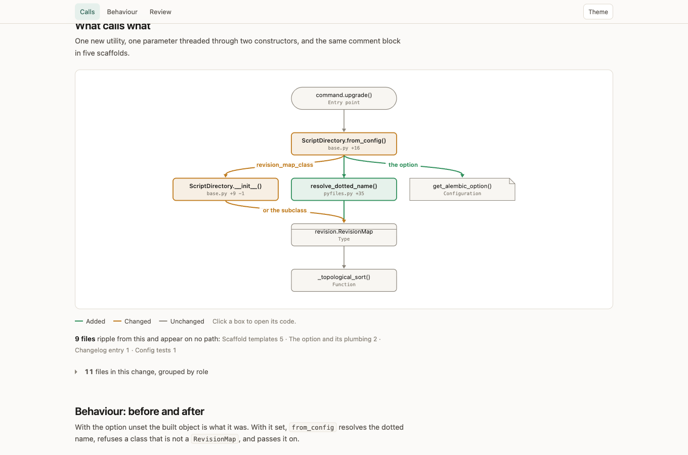
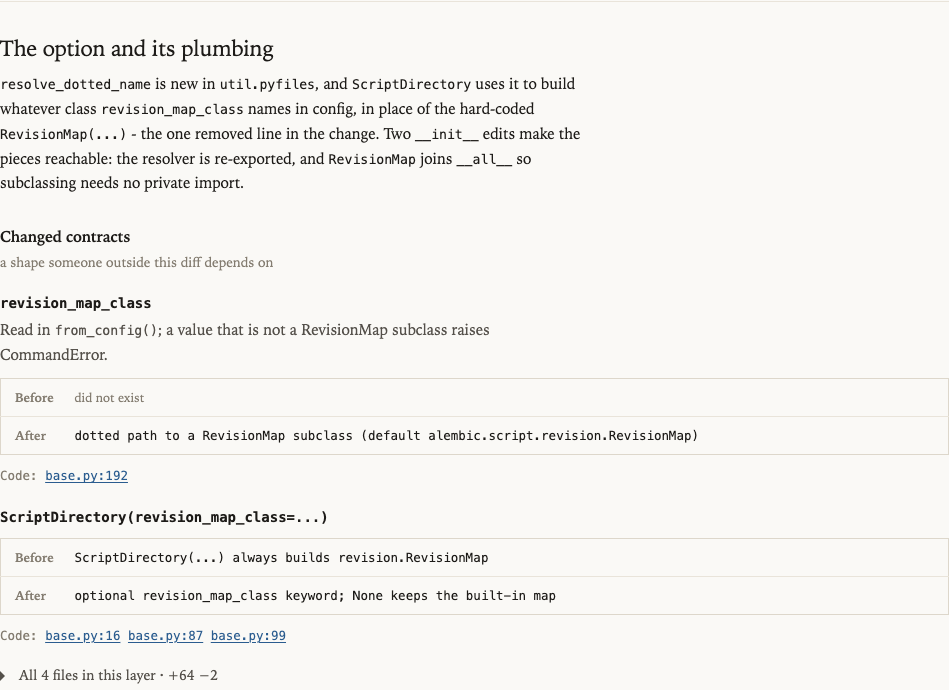

# precis

**Precis explains a pull request. GitHub remains where you review it.**

A *précis* is a concise summary of a text's essential points. It also starts
with "PR."

Precis turns a pull request, merge request, or plain `git diff` into a
self-contained comprehension report. It explains the intended outcome, compares
the ticket contract with the delivered scope, separates the essential change
from support and mechanical ripple, and draws behavior or dependency diagrams
when code makes those relationships hard to reconstruct.

It does not show the diff, prescribe a reading order, track reviewed files, or
provide checkboxes and approval state. Your source host already does those jobs.

## Install

Precis is a Claude Code plugin.

```text
/plugin marketplace add josipmusa/precis
/plugin install precis
```

Then ask naturally:

```text
walk me through PR 1184
explain this diff before I review it
get me oriented in https://github.com/acme/api/pull/903
```

It needs `gh` or `glab` for hosted changes, `git` for ranges, and Python 3.9 or newer.
It has no runtime package dependencies or service.

## What the report answers

### Outcome and scope

The report opens with what works differently, then compares the linked ticket
or PR description with the diff:

- Delivered
- Not delivered, including the stated reason when one exists
- Extra work that rode along

If the ticket cannot be reached, the report says that the PR description became
the contract.

### Change composition

Precis gives the essential-change share a prominent chapter. Changed lines are
split into:

- Essential change: the decision or behavior the PR exists to introduce
- Supporting change: tests, adapters, migrations, and nearby work needed for it
- Mechanical ripple: generated files, formatting, lockfiles, renames, and
  repeated propagation

This makes a 1,400-line diff driven by a four-line decision legible at a glance.

### Behavior and structure

Before and after diagrams show ordering, branching, state, or async behavior
when a picture materially helps. A call map can include unchanged callers that
a diff view hides. Every relationship points to a hunk or `path:line`; if there
is no useful changed relationship, there is no diagram.



### Change map and contracts

Files are grouped by concern in execution or dependency order. The prose
explains why each concern changed and what consequence to expect. The complete
file inventory stays collapsed and secondary.

Changed APIs, schemas, wire formats, configuration, flags, and CLI surfaces are
shown as before and after pairs. Caller searches can expose untouched dependants
outside the diff.



### Genuine risk flags

Precis can flag a concrete boundary introduced by the change, such as a retry
that may replay a side effect, a guard that covers one route but not another, or
state that assumes an earlier step ran.

Every flag is `PROVEN` or `UNPROVEN`, names what could break, points to the
changed decision, and shows boundary-focused test evidence directly beneath it.
It is a claim for the reviewer to verify, not a quality verdict.

Most importantly, a report is allowed to say:

> **No risk flags found.**

Precis never invents risk to fill a section.

### Verification and uncertainty

The report records commands actually run and concise real output. Skipped checks
are named with a reason. Assumptions and open questions close the report only
when the available evidence cannot settle something.

## Examples

Three real public pull requests exercise different shapes:

| Report | Pull request | Shape |
|---|---|---|
| [`requests-7413`](examples/requests-7413.html) | [psf/requests#7413](https://github.com/psf/requests/pull/7413) | 2 files, +35 -0. A two-line fix and its test. |
| [`alembic-1805`](examples/alembic-1805.html) | [sqlalchemy/alembic#1805](https://github.com/sqlalchemy/alembic/pull/1805) | 11 files, +214 -2. A new extension point. |
| [`httpx-3768`](examples/httpx-3768.html) | [encode/httpx#3768](https://github.com/encode/httpx/pull/3768) | 17 files, +56 -67. One lint rule and its ripple. |

GitHub displays stored HTML source instead of rendering it. Clone the repository
and open the examples from disk. See [`examples/README.md`](examples/README.md).

## How it works

```text
diff -> parse -> classify -> investigate -> reconcile -> render -> report.html
```

- `parse_diff.py` turns a unified diff into paths, hunks, line numbers, and
  exact counts.
- `classify.py` distinguishes signal from generated and mechanical content and
  applies a bounded analysis budget.
- The analysis phase reads intent, repository context, callers, and behavior.
- `build_model.py` reconciles every count and evidence reference with parsed
  facts.
- `validate_model.py` enforces character caps, evidence invariants, and the rule
  that a risk flag cannot exist without proof state.
- `render_report.py` produces one offline HTML file and a short Markdown digest.

The page has no CDN, fonts, analytics, telemetry, or server. Network access is
limited to read-only `gh`, `glab`, and `git` commands used to obtain the change.

## What it will not do

- Replace the GitHub or GitLab diff viewer
- Track review completion
- Comment, approve, push, merge, or modify the source repository
- Manufacture generic risks
- Claim that a change is correct, safe, or ready
- Send report content anywhere

## Contributing

See [CONTRIBUTING.md](CONTRIBUTING.md). The most useful report is a concrete
comprehension failure: something important the reader still had to reconstruct
from code after reading the report.

## License

MIT. See [LICENSE](LICENSE).
