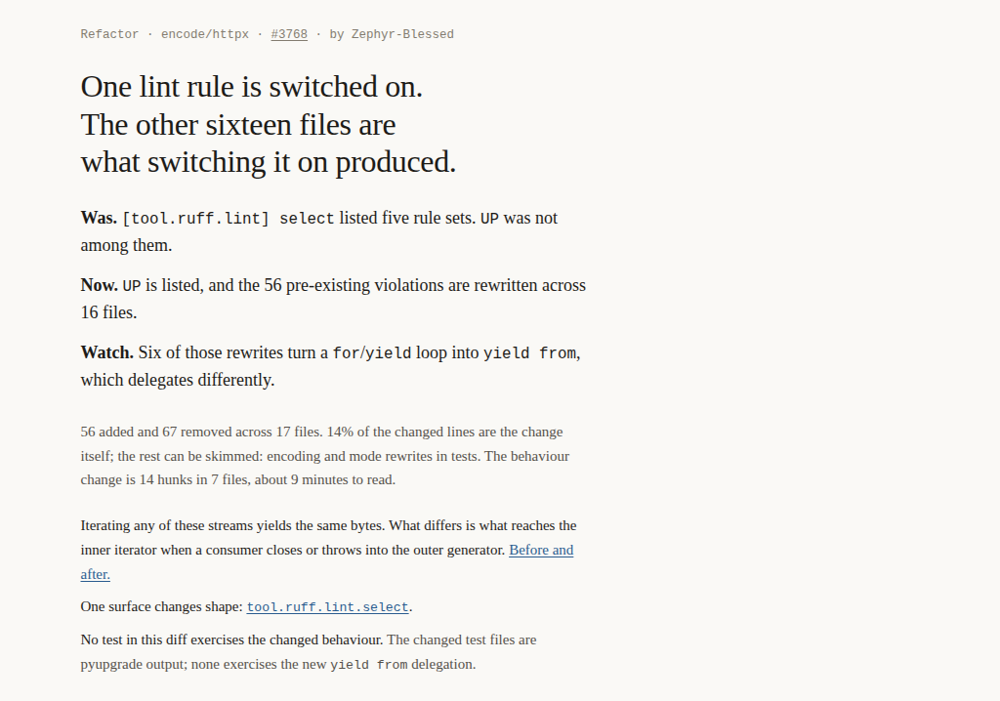
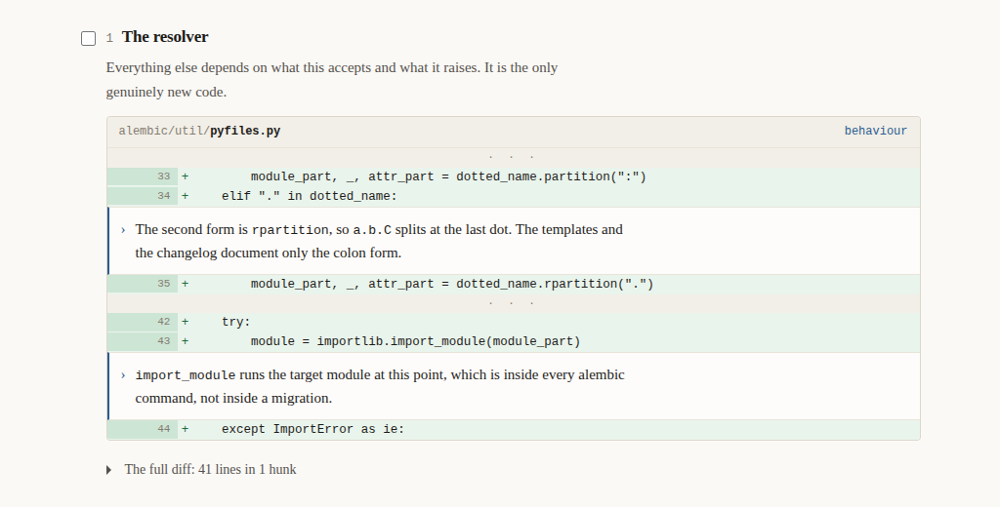
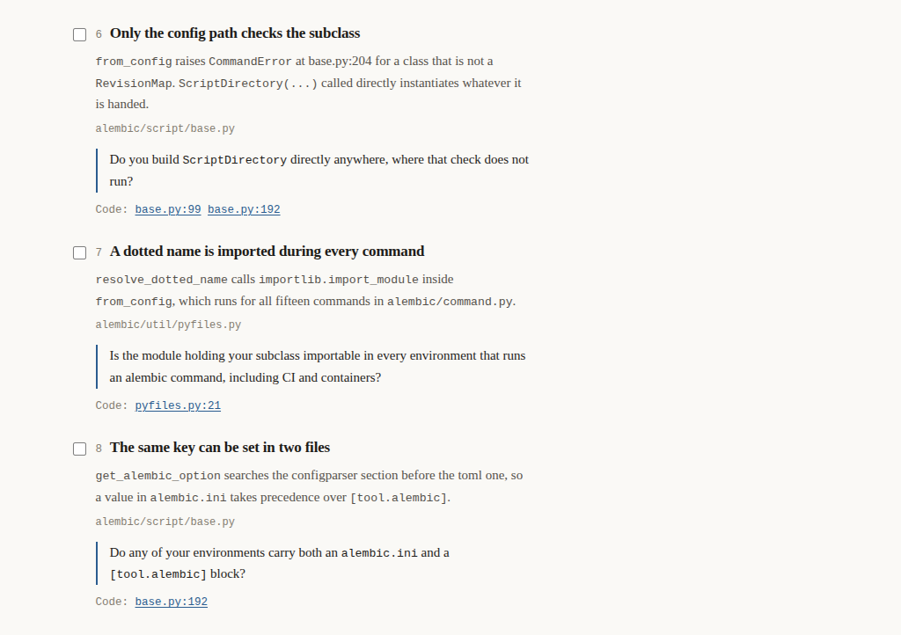

# precis

**precis is not a code review tool. It's a tool that helps humans review code.**

A *précis* is a concise summary of a text's essential points. It also starts with "PR."

precis takes a pull request, merge request, or plain `git diff` and produces a
**comprehension artifact**: one self-contained HTML file that explains what the change
does, which parts are the actual change, which parts are ripple, grouped by the part of
the codebase they belong to, and what only you can decide. Beside it travels a ten-line
markdown digest for the PR comment or the chat message, and for a trivial diff the
digest is the whole deliverable, because a full report for a 30-line fix costs more to
open than the diff it explains.

It never tells you whether the code is good. That is your job, and handing you a verdict
is the fastest way to stop you doing it.



That is a real report for [encode/httpx#3768](https://github.com/encode/httpx/pull/3768),
a pull request that touches 17 files. One of those files is a decision: a single lint rule
added to `pyproject.toml`. The other sixteen are what enabling it produced. GitHub shows
you seventeen files in alphabetical order and lets you work out which is which.

---

## Install

precis is a Claude Code plugin.

```
/plugin marketplace add josipmusa/precis
/plugin install precis
```

Then ask for what you want, in your own words:

```
walk me through PR 1184
explain this diff before I review it
get me oriented in https://github.com/acme/api/pull/903
```

It needs `gh` (or `glab`) for pull requests, `git` for ranges, and Python 3.9 or newer.
Nothing else: no packages to install, no services, no keys.

## What a report contains

**A story, in three beats**, and the share of the diff that is the change itself. Plus
what the description claims, set against what the diff does, quoting the author verbatim.

**The ten-second answers, before anything else.** Whether runtime behaviour changes,
whether anything someone outside the diff depends on changes shape, and whether tests
arrive with the change. Three plain sentences under the story, each one a fact or a link
to where it is shown, so you know what you are walking into before you read a hunk. When
a change reads as two independent changes, that is a fourth.

**The change, grouped by area.** Every file lands in the part of the codebase it belongs
to: the domain decision, the API contract, the persistence behind it, the tests that pin
it. A frontend change groups by components, state, and styling instead. Each area carries
its own reading, its own questions, and its own file list, so you finish one area before
you start the next. The code itself waits behind one fold per area, and opens when you
are ready to read rather than greeting you as a wall.

**Every changed contract, as a before/after table.** A changed signature, schema, config
default, or feature flag is a delta, so it renders as one: what it was, what it is now,
in two rows you can check at a glance. And because precis runs with the checkout, it can
say the thing a diff view structurally cannot: how many call sites the surface has
elsewhere in the repository, how many this diff also updates, and exactly where the ones
it does not touch live.


**Inside each area, the lines that matter.** A reading step shows the lines precis
annotated, with a line of context each side; the full diff is one fold away. The order
still runs across the whole change, so definition still comes before use, and every hunk
wears one of four labels: behaviour, contract, mechanical, or tests.



**Checks you tick off**, each one a question precis cannot answer, because answering it
needs context that lives in your head and not in the repository. Each check sits in the
area it belongs to.



**A call graph across files**, including the callers that did not change, which are
exactly the ones a diff view hides. Every edge points at a hunk or a `path:line`; an edge
precis cannot evidence is an edge it does not draw. And when the change moves no
structure at all, there is no diagram, because a map of unchanged code is decoration.


**Your project's own rules, quoted.** precis reads the documents that state them,
`CLAUDE.md`, `CONTRIBUTING.md`, a style guide, an ADR, and where the change departs from
one it quotes the rule verbatim with the line it is written on, then asks whether this is
an agreed exception. It reads the rules as they stand *after* the change, so a pull
request that rewrites a rule is following the new one and departs from nothing.

**And an honest account of what it skipped**, with the reason, and the file list, so
nothing is quietly hidden.

The whole page is one file. No server, no build step, no network. Open it from a laptop,
attach it to a ticket, read it on a plane.

## Examples

Three real, open pull requests, picked to be different from each other:

| Report | Pull request | Shape |
|---|---|---|
| [`requests-7413`](examples/requests-7413.html) | [psf/requests#7413](https://github.com/psf/requests/pull/7413) | 2 files, +35 −0. A two-line fix and the test that pins it. |
| [`alembic-1805`](examples/alembic-1805.html) | [sqlalchemy/alembic#1805](https://github.com/sqlalchemy/alembic/pull/1805) | 11 files, +214 −2. A new extension point, with docs, scaffolds and tests. |
| [`httpx-3768`](examples/httpx-3768.html) | [encode/httpx#3768](https://github.com/encode/httpx/pull/3768) | 17 files, +56 −67. One lint rule, and sixteen files of consequence. |

GitHub shows you the source of a stored HTML file rather than rendering it, so clone the
repository and open them from disk. See [`examples/README.md`](examples/README.md).

## How it works

The JSON schema is the contract, and every stage is only allowed to do its own job.

```
diff ─▶ parse_diff.py ─▶ classify.py ─▶ the model ─▶ build_model.py ─▶ render_report.py ─▶ report.html
        facts            signal/noise    judgement    copies the diff   template only
```

- **`parse_diff.py`** turns a unified diff into facts: files, hunks, line numbers, renames,
  binary files, CRLF, quoted paths. Deterministic, and it refuses a merge diff by name
  rather than guessing at one.
- **`classify.py`** decides what is signal and what is noise from path conventions, file
  shape, and the banners generators write about themselves, and elides hunk bodies until
  the report fits a byte budget: noise first, and it says on the page when it had to.
- **The model** is the only stage with judgement in it, and the only one a language model
  writes. It never writes diff text and it never writes HTML.
- **`build_model.py`** copies the hunk bodies in from the parser, checks every stated
  number against it, and refuses to write a model that disagrees.
- **`render_report.py`** validates the model and fills one template. The template renders
  from the embedded JSON and nothing else. The same validated model also yields the
  ten-line markdown digest, so the digest inherits every guarantee the report has,
  the verdict scan included.

`validate_model.py` is the contract in executable form. Two of its checks are the product
rather than hygiene: a character cap on every prose field, because a reviewer in a hurry
skips paragraphs, and a scan for the vocabulary of judgement, because every model running
this skill drifts toward reviewing and a validator that exits 1 is the only thing that has
reliably stopped it.

## What it will never do

- Say whether a change is good, correct, safe, or ready.
- Report bugs, risks, severities, or suggestions.
- Comment on a pull request, push, or modify anything. Every command it runs is read-only.
- Send anything anywhere. No telemetry, no uploads, no network beyond `gh`, `glab`, and
  `git` reading. The report itself makes no requests at all: no CDN, no fonts, no
  analytics, nothing to block.

If a report ever tells you what to think about a change, that is a bug, and
[the most useful kind to report](CONTRIBUTING.md).

## Requirements

Python 3.9 or newer, standard library only. No runtime dependencies, deliberately: the
skill has to run inside someone else's agent sandbox without a package install step.
`pytest` is used for the tests and is not needed to run the tool.

## Contributing

See [CONTRIBUTING.md](CONTRIBUTING.md). The most valuable bug report is not a crash, it is
*"I read the report, then I read the diff, and it sent me to the wrong place first."*

## License

MIT. See [LICENSE](LICENSE).
